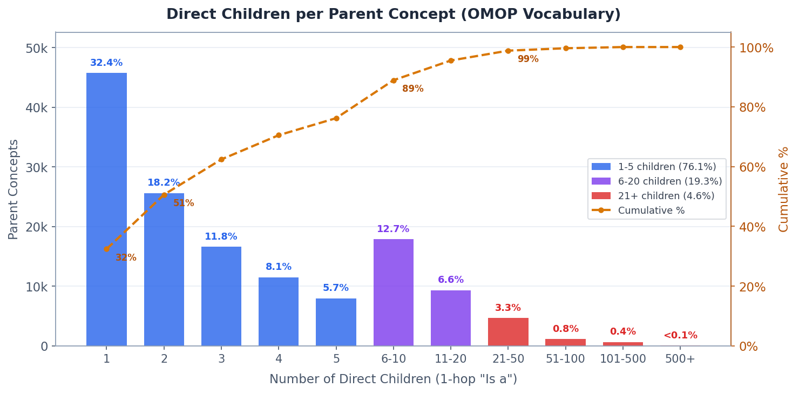

# 1. 프로젝트 제목

**Clinician-in-the-Loop OMOP Criteria Mapper**
— Target Trial Emulation을 위한 Eligibility Criteria Concept Mapping Interactive Review System

### Interactive Demos

> **[통합 데모 페이지 (demo-all.html)](../demos/demo-all.html)** — 아래 4개 데모를 탭으로 전환하며 한 화면에서 확인

| Demo | 기법 | 링크 |
|------|------|------|
| 4패널 통합 데모 | Criteria Highlight + Cards + Graph + Dashboard | [demo.html](../demos/demo.html) |
| Space-Filling | Treemap / Sunburst — 전체 vocabulary 분포 overview | [demo-space-filling.html](../demos/demo-space-filling.html) |
| Focus+Context | DOI Tree + Semantic Zoom — 탐색 효율 극대화 | [demo-focus-context.html](../demos/demo-focus-context.html) |
| Interactive Selection | Drag-to-select, Lasso, Visual Concept Set Builder | [demo-interactive-select.html](../demos/demo-interactive-select.html) |
| Mapping Review | Anchor-based hierarchy — 매핑 결과 주변 자동 전개, 시각적 gap 발견 | [demo-mapping-review.html](../demos/demo-mapping-review.html) |
| Child Distribution | OMOP 직계 자식 수 히스토그램 — 95%가 ≤19개, 트리 전개 전략 근거 | [demo-child-histogram.html](../demos/demo-child-histogram.html) |
| Feasibility Check | Threshold 슬라이더 + Attrition Waterfall — 실시간 cohort 크기 추정 | [demo-feasibility.html](../demos/demo-feasibility.html) |
| **Integrated Review** | **Tree에서 concept 클릭 교체 → Funnel 실시간 갱신 (핵심 데모)** | [demo-integrated.html](../demos/demo-integrated.html) |

## 2. 문제 정의

### 2.1 OMOP 기반 데이터 표준화

OMOP는 Observational Medical Outcomes Partnership의 약자로, 여러 기관의 관찰 의료 데이터를 공통된 방식으로 분석하기 위해 만들어진 표준화 프레임워크이다. 현재는 OHDSI(Observational Health Data Sciences and Informatics) 커뮤니티를 중심으로 발전해 왔으며, 병원 전자의무기록, 청구자료, 검사자료처럼 기관마다 다른 형태로 저장된 데이터를 동일한 분석 구조로 맞추는 데 사용된다.

OMOP Common Data Model(CDM)은 이 표준화 프레임워크의 데이터 구조에 해당한다. 즉, 환자, 방문, 진단, 약물 노출, 검사 결과, 처치 등의 정보를 어떤 테이블과 컬럼에 저장할지 정의하는 공통 스키마이다. 각 병원이 보유한 원천 데이터는 OMOP CDM 형태로 변환되며, 이렇게 변환되면 같은 코호트 정의와 분석 코드를 여러 기관 데이터에 비교적 일관되게 적용할 수 있다. 2025년 기준 전 세계 49개국 500개 이상의 데이터 소스에서 약 10억 명의 고유 환자 기록이 OMOP CDM으로 변환되어 있으며, 이는 전 세계 인구의 약 12%에 해당한다. 국내에서는 아주대학교를 중심으로 결성된 OHDSI Korea 컨소시엄을 통해 60개 이상의 의료기관이 CDM을 구축·운영하고 있으며, 건강보험심사평가원(HIRA)의 전 국민 청구 데이터(약 5,600만 명)도 OMOP CDM으로 변환되어 활용되고 있다.

OMOP Vocabulary는 CDM 안에서 사용하는 표준 용어 체계이다. SNOMED CT, RxNorm, LOINC, ICD 계열 코드 등 서로 다른 의료 용어를 OMOP concept라는 단위로 정리하고, 각 concept에 concept ID, domain, vocabulary source, standard concept 여부를 부여한다. 또한 concept 간의 상하위 관계, 동등 또는 매핑 관계를 제공하므로, 한 criteria가 어떤 표준 concept로 연결되어야 하는지 판단할 때 핵심 근거가 된다. 따라서 본 프로젝트에서 말하는 "criteria-to-concept mapping"은 임상시험 eligibility criteria의 질환, 약물, 검사, 값 조건을 OMOP Vocabulary의 적절한 표준 concept와 연결하는 작업을 의미한다.

### 2.2 대상 데이터 및 특성

본 프로젝트는 **OMOP Common Data Model(CDM) 기반의 표준 의료 용어 데이터**를 다루며, 두 종류의 데이터를 사용한다.

#### OMOP Vocabulary (44만 concept)

OMOP 표준 용어 체계로, SNOMED CT, RxNorm, LOINC, ICD 계열 등 다양한 의료 용어를 통합한 concept 집합이다. 각 concept의 계층 관계(parent-child-sibling), cross-vocabulary 매핑 관계(Maps to, Mapped from), 도메인(Condition, Drug, Measurement 등)을 포함하며, AI가 추천한 매핑 결과의 적절성을 검토할 때 vocabulary 구조 시각화의 기반이 된다.

#### Synthea 합성 임상 데이터 (약 230만 명, OMOP CDM v5.4)

Synthea는 미국 인구통계 기반의 합성 환자 데이터 생성기로, 실제 질병 발생률, 치료 패턴, 검사 주기를 모사하여 현실적인 임상 데이터를 생성한다. 본 프로젝트에서는 약 230만 명 규모의 Synthea 합성 데이터를 OMOP CDM v5.4 형식으로 변환하여 사용한다.

이 데이터는 다음의 CDM 테이블을 포함한다:

| CDM 테이블 | 내용 | 시각화 활용 |
|------------|------|-------------|
| person | 환자 인구통계(연령, 성별, 인종) | concept별 환자 분포 시각화 |
| condition_occurrence | 진단 기록 | condition concept 환자 수, 유병률, 동시 발생 |
| drug_exposure | 약물 처방/투여 | drug concept 환자 수, 노출 기간, 치료 패턴 |
| measurement | 검사 결과(값 포함) | lab value 분포, threshold 슬라이더, 이상치 비율 |
| procedure_occurrence | 시술/처치 기록 | procedure concept 빈도 |
| visit_occurrence | 방문 기록(입원/외래/응급) | concept별 방문 유형 분포 |
| observation | 관찰 항목 | 사회력, 임상 소견 |

합성 데이터를 사용함으로써 개인정보 보호 이슈 없이 실제 임상 데이터와 유사한 환자 분포, 질병 패턴, 검사값 분포를 시각화에 활용할 수 있다. 특히 concept별 환자 수, 연령/성별 분포, 측정값 히스토그램, 동시 발생 패턴, cohort attrition 등의 **aggregate-level 통계**를 concept 매핑 검토 시점에 오버레이하여 의료진의 판단을 지원한다.

#### 검증용 임상시험 데이터

시각화 시스템의 유효성을 검증하기 위해, 실제 Phase III 임상시험의 eligibility criteria를 사용한다. 각 연구의 프로토콜에서 추출한 포함·제외 기준을 AI 매핑 시스템의 입력으로 사용하고, 매핑 결과의 검토 과정을 시각화한다.

| 연구 | NCT | 치료군 약물 | 질환 영역 |
|------|-----|-----------|-----------|
| LEADER | NCT01179048 | Liraglutide (GLP-1 RA) | T2DM + CV outcomes |
| PLATO | NCT00391872 | Ticagrelor vs Clopidogrel | Acute Coronary Syndrome |
| ARISTOTLE | NCT00412984 | Apixaban vs Warfarin | Atrial Fibrillation + Stroke |

이 3개 연구는 질환 도메인(내분비, 심혈관, 혈액학), criteria 복잡도(LEADER 12개, PLATO 15개, ARISTOTLE 18개), 약물 유형(생물학적 제제, 저분자 약물, 항응고제)이 다양하여, 시각화 시스템이 다양한 매핑 시나리오를 처리할 수 있는지 검증하는 데 적합하다.

구체적으로, 임상시험 프로토콜에 기술된 포함·제외 기준(eligibility criteria)과 OMOP 표준 vocabulary(SNOMED CT, RxNorm, LOINC 등 약 44만 개 concept) 사이의 매핑 관계가 핵심 데이터이다. 하나의 criteria 문장(예: "Type 2 diabetes with HbA1c > 7%")은 파싱을 거쳐 질환명, 약물명, 검사항목, 값 범위, 시간 조건 등의 구조화된 엔티티로 분해되고, 각 엔티티에 대해 AI 매핑 시스템이 후보 OMOP concept 목록과 confidence 점수, concept 간 계층 관계(parent-child-sibling), vocabulary 출처 등의 메타데이터를 생성한다.

이 데이터는 단순한 용어 검색 결과가 아니라, criteria의 임상적 맥락(동반 조건, 논리 구조, 값 제약)이 반영된 다층적 추천 결과이며, 의료진이 이를 검토·승인해야 최종적으로 코호트 정의(cohort definition)로 변환된다.

### 2.3 시각화의 필요성 및 기존 도구의 한계

Target Trial Emulation에서 eligibility criteria를 OMOP concept로 매핑하는 과정은 연구의 재현성과 코호트 품질을 좌우하는 핵심 단계이다. 최근 LLM과 knowledge graph를 활용한 반자동 매핑 시스템이 등장하여 후보 concept 추천의 정확도는 크게 향상되었으나, **AI가 추천한 결과를 의료진이 최종 검증하는 단계**에서 여전히 병목이 발생한다.

현재 OHDSI 생태계의 주요 도구들은 이 검토 과정을 효과적으로 지원하지 못한다. 의료진은 AI 추천 결과를 받은 뒤에도 Athena를 별도로 열어 concept를 하나씩 확인하고, 계층 관계를 수동으로 탐색하며, 판단 근거를 별도 스프레드시트에 기록해야 한다. 이 과정에서 **검토 시간이 길어지고, 판단의 일관성이 떨어지며, 매핑 이력이 축적되지 않는** 문제가 발생한다. 구체적인 한계는 다음과 같다:

#### Athena의 한계

Athena는 OHDSI 커뮤니티의 OMOP vocabulary 브라우저로, 개별 concept의 상세 정보(ID, 도메인, 관계, 계층)를 검색·열람하는 데 특화되어 있다. 그러나 다음과 같은 한계가 있다:

- **단일 concept 검색 중심**: 한 번에 하나의 concept만 조회 가능. 여러 후보를 나란히 비교하는 기능이 없어, 의료진은 별도 탭이나 스프레드시트에 결과를 복사하여 비교해야 한다.
- **Criteria 문맥 부재**: eligibility criteria의 원문, 포함/제외 조건, 값 제약, 시간 조건 등의 맥락 없이 순수 vocabulary 정보만 표시.
- **임상 데이터 연계 없음**: concept가 실제 CDM에서 몇 명의 환자에게 나타나는지, 어떤 분포를 보이는지 확인할 수 없다.
- **매핑 워크플로우 미지원**: 검토 결과(승인/거부)를 기록하거나, 매핑 이력을 관리하는 기능이 없다.

#### Usagi의 한계

Usagi는 source 용어를 OMOP 표준 concept에 매핑하는 도구로, string similarity 기반의 반자동 매칭을 제공한다.

- **용어 단위(term-level) 매칭**: criteria 문장이 아닌 개별 용어의 문자열 유사도만으로 후보를 추천하여, 복합 조건의 맥락을 활용하지 못한다.
- **계층 탐색 제한**: 매핑 결과의 상하위 관계를 탐색하는 인터랙티브 시각화가 없다.
- **수동 검토**: AI 추론 근거나 confidence 점수가 없어, 의료진이 모든 후보를 하나씩 수동으로 검증해야 한다.
- **임상 데이터 미연동**: vocabulary 정보만으로 매핑을 수행하며, CDM 내 실제 환자 분포를 참고할 수 없다.

#### ATLAS의 한계

ATLAS는 OHDSI 생태계의 cohort definition builder로, concept set 구성과 cohort 분석에 사용된다.

- **매핑 완료 후 도구**: "어떤 concept를 포함할 것인가"를 결정하는 매핑 단계를 지원하지 않는다.
- **AI 추천 부재**: concept set 구성 시 의료진이 직접 concept를 검색·선택해야 한다.
- **Criteria 문맥 분리**: cohort definition은 criteria 원문과 분리되어 관리된다.

#### Artemis의 한계 (본 연구팀의 선행 연구)

Artemis는 본 연구팀이 기 연구·개발한 AI 기반 Target Trial Emulation 자동화 시스템이다. 임상시험 프로토콜의 eligibility criteria를 입력받아, LLM 기반 criteria 파싱(Agent1), Knowledge Graph + vector search 기반 OMOP concept 매핑(Agent2), WebAPI 연동 cohort 생성(Agent3), IPTW/Cox 분석(Agent5), PDF 리포트 생성(Agent6)까지의 전 과정을 다단계 에이전트 파이프라인으로 자동화한다. 그러나 시각화 관점에서 다음 한계가 존재한다:

- **매핑 결과의 시각적 검토 부재**: Agent2가 추천한 concept는 JSON 형태로 반환되며, 의료진이 계층 구조 속에서 이를 직관적으로 탐색하거나 비교할 수 있는 인터랙티브 시각화가 제공되지 않는다.
- **임상 데이터 맥락 미표시**: concept 매핑 시 CDM 내 환자 수, 분포, missingness 등의 임상 통계가 매핑 결과와 함께 표시되지 않아, 의료진이 매핑의 실질적 타당성을 판단하기 어렵다.
- **Feasibility 사전 검증 불가**: criteria 전체를 적용했을 때의 예상 cohort 크기를 매핑 단계에서 확인할 수 없으며, 이는 cohort 생성(Agent3) 이후에야 파악 가능하다.
- **빠진 concept의 시각적 발견 불가**: 매핑 결과에 포함되지 않은 관련 concept(형제, 자녀)를 계층 구조에서 탐색하는 기능이 없어, 누락된 concept를 발견하려면 Athena를 별도로 사용해야 한다.

본 프로젝트는 Artemis의 AI 매핑 파이프라인 위에 인터랙티브 시각화 계층을 추가하여, 위의 한계를 해결하는 것을 목표로 한다.

#### 기능 비교 요약

| 도구 | Vocabulary 구조 | 임상 데이터 | AI 매핑 | 의료진 검토 |
|------|:---:|:---:|:---:|:---:|
| Athena | O | X | X | X |
| Usagi | O | X | 반자동 | 수동 |
| ATLAS | 부분 | O (cohort 수준) | X | X |
| Artemis (선행) | 부분 | X | O (LLM+KG) | X |
| **본 시스템** | **O** | **O (concept 수준)** | **O (LLM+KG)** | **O (HITL)** |

핵심 차별점: **매핑 결정 시점(decision time)에 임상 데이터를 제공하는 도구가 기존에 존재하지 않는다.** 본 시스템은 AI가 추천한 매핑을 의료진이 검토하는 바로 그 시점에 계층 구조 + 임상 통계 + cohort 영향도를 동시에 제공함으로써, 매핑 품질과 검토 효율을 함께 향상시킨다.

## 3. 시각화 및 구현 계획

본 시스템의 시각화는 3개 축으로 구성한다: (1) 계층적 구조 데이터의 효율적 시각화, (2) 임상 데이터 통합(Clinical Context Overlay), (3) 매핑 검토 인터페이스. 이 중 (1)과 (2)가 본 프로젝트의 핵심 연구 주제이며, (3)은 이를 실제 워크플로우에 통합하는 응용 계층이다.

### 3.1 계층적 구조 데이터의 효율적 시각화

OMOP vocabulary는 44만 개 concept가 다단계 계층(SNOMED CT 기준 10단계+)을 이루며, Is a, Maps to, Mapped from 등 heterogeneous edge를 갖는 DAG 구조이다. 이를 효율적으로 시각화하기 위해 다음 기법들을 적용한다.

- **Space-Filling Visualization** — Treemap과 Sunburst를 사용하여 전체 vocabulary 규모와 도메인별 분포를 한눈에 조망하고, 클릭으로 하위 계층을 drill-down한다.
- **Focus+Context Visualization** — DOI(Degree of Interest) Tree로 관심 concept 주변은 상세하게, 나머지는 축약하여 전체 구조를 유지하면서 탐색 효율을 높인다. Semantic Zoom으로 줌 레벨에 따라 노드 표현을 3단계로 전환한다.
- **Anchor-Based Hierarchy Navigation** — AI가 매핑한 concept를 anchor로 삼아 계층을 자동 전개하고, 형제 노드(discoverable siblings)를 시각적으로 표시하여 검색 없이 빠진 concept를 발견한다. 하나의 criterion에 대해 **여러 concept를 동시에 선택**(multi-select)할 수 있으며, 트리 노드를 클릭하여 concept set에 추가/제거한다. AI가 원래 추천한 concept는 금색 링으로 항상 표시되어 기준점을 유지하고, 추가된 concept는 초록색 체크마크로 구분된다. concept를 추가할수록 해당 criterion에 매칭되는 환자가 늘어나며(union 모델), 이 변화는 cohort attrition 퍼널에 실시간으로 반영된다.
- **Interactive Visual Selection** — Drag-to-add, Lasso 선택, Subtree 모드, Include Descendants 토글 등으로 그래프/트리 위에서 직접 concept를 선택하여 concept set을 구축한다. Graph(force-directed)와 Tree(계층) 레이아웃을 전환하여 관계 중심 또는 구조 중심으로 탐색할 수 있다.

OMOP vocabulary의 직계 자식 수(1-hop "Is a" 관계) 분포를 실제 CDM 데이터에서 분석한 결과는 다음과 같다:

*Figure 1. OMOP 표준 concept의 직계 자식 수 분포 (141,051 parent concepts). 파란색 = 전부 펼침 가능(1-5개), 보라색 = 확장 가능(6-20개), 빨간색 = "+N more" 노드 필요(21개+). 점선 = 누적 비율. T2DM(16개)은 95th percentile 수준.*

*Table 1. OMOP 표준 concept의 직계 자식 수(1-hop "Is a") 요약 통계. 141,051개의 standard parent concept를 대상으로 산출하였다.*

| 지표 | 값 | 해석 |
|------|-----|------|
| 중앙값 | 2개 | 절반 이상의 concept가 이진 분기 수준으로, 트리 표현에 적합 |
| 평균 | 6.08개 | 소수의 대규모 concept가 평균을 끌어올림 (right-skewed) |
| 95th percentile | 19개 | 95%의 concept는 자식 19개 이하 — 시각적으로 전부 펼침 가능 |
| 최대 | 1,864개 | Assessment scales, Geography 등 비임상 도메인에 집중 |

이 분포에 기반한 **시각화 전개 전략**:
- **자식 ≤ 20개 (95.4%)**: 전부 펼침 — 대다수 concept에서 트리 전개가 시각적으로 관리 가능
- **자식 > 20개 (4.6%)**: CDM 빈도 기준 상위 10개 + "+N more" 접기 노드. 클릭 시 freq 정렬 목록 펼침
- 최악의 경우(1,864개)는 Geography, Assessment scales 등 비임상 도메인에 집중되어 있어 실제 매핑 검토에서는 거의 발생하지 않음

세부 구현 계획은 [implementation_detail.md](implementation_detail.md) 참조.

### 3.2 임상 데이터 기반 시각적 맥락 제공

Vocabulary 계층 시각화 위에 **실제 CDM 데이터의 집계 통계**를 오버레이하여, 매핑 결정의 근거를 강화한다. 개인정보를 노출하지 않는 aggregate-level 통계만 사용한다.

- **Concept 단위 임상 통계** — 각 concept 노드에 환자 수, 연령/성별 분포, missingness rate, 방문 유형 분포를 부착하여 데이터 존재 여부와 품질을 직관적으로 파악한다.
- **형제 Concept 비교 뷰** — 매핑된 concept의 형제 노드들을 환자 수 기준 바 차트로 비교하고, Concept Specificity Index로 특이도를 수치화한다.
- **Cohort 영향도 미리보기 (Feasibility Check)** — 계층 트리에서의 concept 추가/제거와 threshold 슬라이더 조절이 Attrition Funnel에 실시간으로 반영된다. 각 criterion별 환자 수 감소를 퍼널 차트로 표시하고, concept를 변경하면 해당 단계부터 하류 전체가 연쇄 갱신되어 "이 선택이 최종 cohort를 얼마나 바꾸는가"를 즉시 확인할 수 있다. 이를 통해 프로토콜 확정 전에 feasibility를 시각적으로 검증한다.
- **측정값 분포 시각화** — 측정값 concept에 대해 히스토그램과 threshold 슬라이더를 제공하여 값 조건 변경에 따른 환자 수 변화를 실시간 확인한다.
- **시간 패턴 및 결과 미리보기** — Prevalence trend sparkline, Mini Kaplan-Meier preview, Co-occurrence network로 시간적 패턴과 임상적 연관관계를 데이터 기반으로 제공한다.

세부 구현 계획은 [implementation_detail.md](implementation_detail.md) 참조.

### 3.3 매핑 검토 인터페이스 (향후 확장)

기존 Artemis 시스템에 이미 구현된 기능을 기반으로, 상기 시각화 기법을 실제 매핑 워크플로우에 통합하는 인터페이스이다. 본 프로젝트의 핵심 연구 범위는 3.1과 3.2이며, 아래 컴포넌트는 기존 시스템의 확장으로 향후 진행한다.

- **A. Criteria Span Highlight** — criteria 원문 위에 매핑 대상 엔티티를 도메인별 색상으로 하이라이트하는 inline annotation. 질환(파란색), 약물(초록색), 검사(주황색) 등 도메인별 색상 코딩. 매핑 상태(승인/보류/거부/미처리)를 아이콘으로 표시.
- **B. Candidate Comparison Cards** — AI가 추천한 후보 concept를 비교 카드로 나란히 제시. Confidence bar, reasoning panel(semantic similarity, KG 관계, LLM critic), Approve/Replace/Reject 액션 버튼 포함.
- **C. Concept Hierarchy Graph** — 선택한 concept의 OMOP vocabulary 계층 관계를 인터랙티브 네트워크 그래프로 시각화. 트리 뷰와 그래프 뷰 전환, 노드 클릭으로 상세 정보 표시.
- **D. Mapping Progress Dashboard** — 전체 연구의 매핑 진행 상황을 대시보드로 제공. 진행률 바, confidence 히트맵, 매핑 이력 타임라인.

### 3.4 기술 스택

| 계층 | 기술 | 선정 이유 |
|------|------|-----------|
| Frontend Framework | React + TypeScript | 컴포넌트 기반 3패널 UI 구성에 적합 |
| 스타일링 | TailwindCSS | 빠른 반응형 UI 개발, 카드/뱃지 레이아웃 |
| 계층 그래프 | Cytoscape.js | 의료 온톨로지 시각화에 널리 사용, 대규모 그래프 렌더링 성능 |
| 통계 차트 | Recharts 또는 D3.js | Confidence 히트맵, 진행률 바, 타임라인 |
| Backend API | Python FastAPI | 기존 Artemis 시스템 확장, 비동기 처리 지원 |
| 데이터 저장 | PostgreSQL (OMOP CDM) | OMOP vocabulary, concept 관계, 매핑 이력 |
| 코호트 연계 | CIRCE JSON → ATLAS/WebAPI | 승인된 매핑을 코호트 정의로 자동 반영 |

## 4. 기대 결과물

### 4.1 시스템 개요

완성 시 다음과 같은 인터랙티브 웹 시스템을 제공한다:

**의료진이 임상시험의 eligibility criteria를 불러오면, AI가 추천한 OMOP concept 후보를 3패널 인터페이스에서 비교·탐색하고, Approve/Replace/Reject 액션으로 최종 매핑을 확정하는 웹 시스템**이다.

구체적으로 다음 기능을 포함한다:

1. **Criteria 시각화** — 프로토콜 원문에서 매핑 대상 엔티티를 도메인별 색상으로 하이라이트하고, 각 엔티티의 도메인·값 제약·시간 조건을 인라인으로 표시한다.

2. **후보 Concept 비교** — AI 시스템이 추천한 Top-N 후보 concept를 confidence 점수, vocabulary 출처, 선택 근거와 함께 카드 형태로 나란히 비교할 수 있다. 의료진은 각 후보에 대해 승인·대체·거부를 수행하고 판단 근거를 기록한다.

3. **Concept 계층 탐색** — 선택한 concept의 parent-child-sibling 관계를 인터랙티브 그래프로 탐색할 수 있다. 노드 클릭만으로 상위·하위·동급 concept를 탐색하고, CDM 내 출현 빈도를 확인할 수 있어 Athena를 별도로 열 필요가 없다.

4. **매핑 대시보드** — 전체 criteria의 매핑 진행률, confidence 분포 히트맵, 승인 이력 타임라인을 한 화면에서 파악할 수 있다. 저신뢰 항목을 우선 표시하는 Smart Queue로 검토 순서를 최적화한다.

5. **임상 데이터 오버레이** — 각 concept 노드에 CDM 기반 집계 통계(환자 수, 연령/성별 분포, 측정값 히스토그램, missingness)를 부착하고, concept 교체 시 cohort 크기 변화를 실시간 미리보기로 제공한다.

6. **매핑 이력 재사용** — 승인된 매핑은 자동으로 축적되어, 유사한 criteria가 포함된 후속 연구에서 기승인 concept를 자동으로 제안한다.

7. **코호트 정의 연계** — 승인이 완료된 매핑은 CIRCE JSON 형식의 cohort definition으로 자동 변환되어 ATLAS/WebAPI와 연계된다.

### 4.2 향후 계획

본 프로젝트의 핵심 범위(3.1 계층 시각화 + 3.2 임상 데이터 오버레이)를 완성한 뒤, 다음 단계로 확장을 계획한다.

**단기 (본 프로젝트 범위 직후)**

- **사용자 평가 연구** — 의료정보학 전공자 및 임상 연구자를 대상으로 매핑 검토 태스크의 정확도, 소요 시간, 만족도를 측정. 기존 도구(Athena + 스프레드시트) 대비 A/B 비교 실험 수행.
- **다기관 CDM 지원** — 현재 단일 CDM(Synthea 230만 명)을 기준으로 하나, 향후 여러 기관의 CDM에서 집계 통계를 병렬 비교하는 multi-site view 추가. 동일 concept가 기관마다 다른 빈도를 보이는 패턴을 시각화.

**중기 (3.3 매핑 검토 인터페이스 통합)**

- **Criteria Span Highlight + Candidate Cards** — 3.1/3.2의 시각화를 실제 매핑 워크플로우에 통합. Approve/Replace/Reject 액션과 근거 메모 기록.
- **매핑 이력 축적 및 재사용** — 승인된 매핑을 DB에 축적하고, 유사한 criteria가 등장할 때 기승인 concept를 자동 제안하는 learning loop 구축.
- **CIRCE JSON 자동 생성** — 확정된 concept set을 ATLAS/WebAPI 호환 cohort definition으로 자동 변환.

**장기 (학술 발전 방향)**

- **Concept 선택 민감도 분석** — concept 매핑 결정이 최종 치료 효과 추정치(Hazard Ratio)에 미치는 영향을 시각화. "concept A 대신 B를 선택하면 HR이 얼마나 변하는가"를 tornado diagram이나 forest plot으로 표현.
- **실시간 협업 검토** — 여러 의료진이 동시에 매핑을 검토하고, 의견 충돌 시 시각적 비교를 통해 합의에 도달하는 collaborative review 기능.
- **Cross-study 매핑 패턴 분석** — 여러 임상시험의 매핑 결과를 비교하여, "비슷한 criteria인데 다르게 매핑된 케이스"를 자동 탐지하고 일관성을 점검.

### 4.3 기대 효과 및 Discussion

#### 실사용 증거(Real-World Evidence) 생성 효율 향상

국내에서는 건강보험심사평가원(HIRA)의 전 국민 청구 데이터(약 5,600만 명)와 60개 이상 의료기관의 전자의무기록이 OMOP CDM으로 변환되어 있다. 이러한 전국민 규모의 관찰 데이터를 활용한 Target Trial Emulation 연구는 보건 정책 수립, 의약품 안전성 평가, 급여 결정 등의 근거로 직접 활용될 수 있다.

그러나 현재 TTE 연구의 가장 큰 병목은 eligibility criteria를 OMOP concept로 매핑하는 과정에서 발생하는 전문 인력 의존성과 검토 시간이다. 본 시스템은 AI 추천 + 계층 시각화 + 임상 데이터 오버레이를 통합하여 이 병목을 해소함으로써, 전국민 데이터 기반 실사용 증거(RWE)의 생성 속도와 품질을 동시에 향상시킨다. 이는 궁극적으로 근거 기반 보건 정책의 의사결정 주기를 단축하고, 데이터 기반 의료 정책의 실현 가능성을 높인다.

#### 신약 개발 가속화

Target Trial Emulation은 관찰 데이터로 무작위 대조 시험(RCT)을 모사하는 방법론으로, 임상시험의 설계 단계에서 코호트 타당성 검증, 비교 약물 선정, 결과 변수 정의 등에 활용된다. 본 시스템이 eligibility criteria 매핑의 효율을 높이면, 신약 개발 과정에서 다음과 같은 이점을 기대할 수 있다:

- **임상시험 설계 사전 검증(Feasibility Check)** — 현재 임상시험 프로토콜 설계에서 가장 빈번하게 발생하는 문제 중 하나는, eligibility criteria를 확정한 뒤에야 실제 모집 가능한 환자 수를 확인할 수 있다는 점이다. 프로토콜 작성, IRB 승인, CDM 쿼리 개발을 거쳐 수개월 후에야 "해당 criteria로는 충분한 환자가 확보되지 않는다"는 사실을 발견하게 되면, 처음부터 기준을 재설계해야 한다. 본 시스템은 이 문제를 근본적으로 해결한다. criteria를 입력하고 concept를 매핑하는 시점에 실시간으로 예상 cohort 크기를 표시하며, threshold 슬라이더(예: HbA1c ≥ 7% → 6.5%)를 조절하면 환자 수 변화를 즉시 확인할 수 있다. 이를 통해 **프로토콜 확정 전에 feasibility를 시각적으로 검증**하고, 기준의 완화·강화가 cohort 규모에 미치는 영향을 탐색적으로 분석할 수 있다. 이는 실패한 프로토콜로 인한 시간·비용 낭비를 원천적으로 줄여준다.
- **비교 효과 연구 가속** — 신약 출시 후 기존 약물 대비 효과를 비교하는 TTE 연구를, 매핑 병목 해소를 통해 수 주 이내로 수행 가능. 기존에는 concept 매핑과 검토에만 수일~수주가 소요되었으나, 본 시스템의 AI 추천 + 시각적 검토 워크플로우를 통해 이 단계를 수 시간 이내로 단축할 수 있다.
- **다기관 연구 확장** — OMOP CDM의 분산 연구 네트워크 특성상, 한 번 정의된 매핑을 전 세계 49개국 데이터에 동일하게 적용할 수 있어 글로벌 다기관 약물 감시 및 효과 비교 연구의 진입 장벽을 낮춤

#### 학술적 기여

본 시스템은 정보 시각화(Information Visualization)와 의료정보학(Medical Informatics)의 교차점에 위치한다. 기존에 분리되어 있던 vocabulary 탐색, 임상 데이터 분석, AI 매핑 추천, 의료진 검토 워크플로우를 하나의 통합 시각화 환경으로 결합한다는 점에서 새로운 연구 기여를 제공한다.

특히 "concept 선택이 치료 효과 추정치에 미치는 민감도(concept selection sensitivity)"를 시각화하는 접근은, 시각화 연구와 인과 추론(causal inference) 방법론을 잇는 새로운 연구 방향을 제시할 수 있다.
